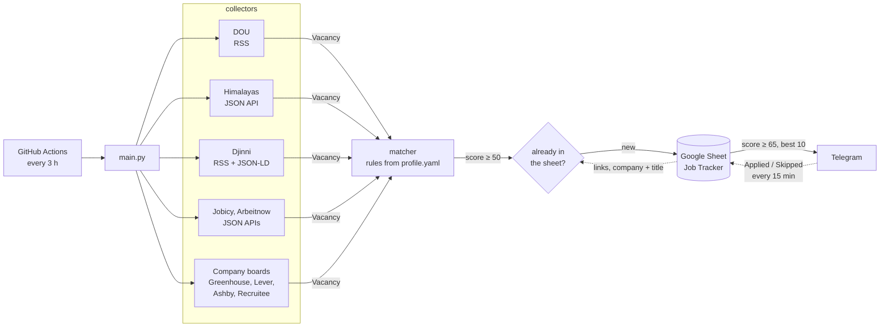

# Job Matcher

[](https://github.com/dim-dimy4/job-matcher/actions/workflows/ci.yml)
[](https://github.com/dim-dimy4/job-matcher/actions/workflows/schedule.yml)
[](https://github.com/dim-dimy4/job-matcher/actions/workflows/buttons.yml)
[](https://github.com/dim-dimy4/job-matcher/actions/workflows/contract.yml)

Collects QA vacancies (DOU, Himalayas, Djinni, Jobicy, Arbeitnow and company boards on Greenhouse, Lever, Ashby and Recruitee), scores them against a candidate profile, sends the good ones to Telegram and logs them in a Google Sheet. Spec: [docs/SPEC.md](docs/SPEC.md).

> Status: MVP done (stage 6 of 6) — runs every 3 hours on GitHub Actions. v2: Djinni, status buttons in Telegram and a matcher calibrated on real verdicts are done; next is LLM scoring.

## Architecture


```mermaid
flowchart LR
    cron["GitHub Actions<br/>every 3 h"] --> main["main.py"]
    subgraph collectors
        dou["DOU<br/>RSS"]
        him["Himalayas<br/>JSON API"]
        djinni["Djinni<br/>RSS + JSON-LD"]
        feeds["Jobicy, Arbeitnow<br/>JSON APIs"]
        ats["Company boards<br/>Greenhouse, Lever,<br/>Ashby, Recruitee"]
    end
    main --> dou & him & djinni & feeds & ats
    dou & him & djinni & feeds & ats -->|Vacancy| matcher["matcher<br/>rules from profile.yaml"]
    matcher -->|"score ≥ 50"| dedup{"already in<br/>the sheet?"}
    dedup -->|new| sheet[("Google Sheet<br/>Job Tracker")]
    sheet -->|"score ≥ 65, best 10"| tg["Telegram"]
    sheet -. "links, company + title" .-> dedup
    tg -. "Applied / Skipped<br/>every 15 min" .-> sheet
```

| Part | Module | Role |
|---|---|---|
| Collectors | [`collectors/`](src/job_matcher/collectors) | One module per board, official feeds/APIs only; each normalizes into the pydantic `Vacancy` model and skips its own failures, so one broken board doesn't stop the run |
| Matcher | [`matcher.py`](src/job_matcher/matcher.py) | Pure function `score(vacancy, profile)`: hard filters, then points, every point with a reason |
| Tracker | [`tracker/sheets.py`](src/job_matcher/tracker/sheets.py) | Appends rows and doubles as the dedup memory: a GitHub runner starts clean, so the sheet is the state that survives between runs |
| Notifier | [`notifier/telegram.py`](src/job_matcher/notifier/telegram.py) | One message per vacancy, at most 10 per run; written after the sheet, so a failed message is never resent |
| Buttons | [`notifier/buttons.py`](src/job_matcher/notifier/buttons.py) | Applied / Skipped under each message: presses are fetched from Telegram and set the Status in the sheet |
| Pipeline | [`main.py`](src/job_matcher/main.py) | Wiring, `--dry-run` and `--buttons-only`; outputs are passed in, so tests run it with fakes |

Workflows: [`ci.yml`](.github/workflows/ci.yml) runs ruff and pytest on every pull request and on `main` (required to merge); [`schedule.yml`](.github/workflows/schedule.yml) runs the search every 3 hours and on demand (*Run workflow*); [`buttons.yml`](.github/workflows/buttons.yml) applies the status buttons every 15 minutes; [`contract.yml`](.github/workflows/contract.yml) checks the live sources daily, separately, so a change on a job board doesn't block pull requests.

## Local setup

Requires Python 3.12+.

```bash
python -m venv .venv
.venv\Scripts\activate          # Linux/macOS: source .venv/bin/activate
pip install -e ".[dev]"

ruff check . && ruff format --check .
pytest --cov            # unit tests, offline
pytest -m contract      # live checks that the sources still return the expected shape
```

Print current QA vacancies from a source, or run the whole pipeline:

```bash
python -m job_matcher.collectors.dou
python -m job_matcher.collectors.himalayas

job-matcher --dry-run   # collect and score, print the matches; no secrets needed
job-matcher             # full run: new matches to the sheet, the best 10 to Telegram
job-matcher --buttons-only  # only apply the status buttons pressed in Telegram
```

## Sources

| Source | How | Notes |
|---|---|---|
| DOU.ua | Official RSS feeds (`category=QA`, `remote` and `relocation`) | 2 requests per run, deduplicated by URL; robots.txt allows `/vacancies/` |
| [Himalayas](https://himalayas.app) | Official public [Remote Jobs API](https://himalayas.app/api), `country=PL`, queries `QA` (2 pages), `Quality Assurance`, `Test Engineer`, `Tester` (1 page each) | 5 requests per run, 2 s apart, deduplicated by URL; links point to the job on Himalayas, whose Apply button is the `applicationLink` required by the [API terms](https://himalayas.app/terms#api) |
| [Djinni](https://djinni.co) | Official RSS (`QA Automation` and `QA`, remote, `exp_level` 2y + 3y + 5y: 2+ years), then the schema.org `JobPosting` data of each job page for company, location and salary | Up to 2 feeds + 60 job pages per run, 2 s apart; robots.txt allows `/jobs/` |

| [Jobicy](https://jobicy.com) | Official free API, `geo=europe`, `industry=qa-testing` (last 7 days) | 1 request per run; links point to the Jobicy job page, which the API terms ask for |
| [Arbeitnow](https://www.arbeitnow.com) | Official free API, first page (300 newest jobs, about two days) | 1 request per run, filtered here to QA-like titles that are remote or in Poland; links point to Arbeitnow, as the terms ask |
| Company boards | Public job-board APIs of Greenhouse, Lever, Ashby and Recruitee for the companies in [`config/companies.yaml`](config/companies.yaml) | 1 request per company, 1 s apart; QA-like titles open to someone in Poland (Poland or a Polish city, or remote without a narrower region than Europe) |

Every source's robots.txt and terms were checked before it was added ([SPEC §4.1](docs/SPEC.md)). To follow another company, add it to `config/companies.yaml` with its ATS and board slug (the part of the board URL after the ATS host, e.g. `jobs.lever.co/<slug>`); companies on other systems (Workday, Workable, Teamtailor…) aren't supported.

JustJoin.it and No Fluff Jobs were considered and rejected: their robots.txt and terms forbid automated collection (details in [SPEC §4.1](docs/SPEC.md)).

## Matching

Rules from [SPEC §6](docs/SPEC.md), profile data in [config/profile.yaml](config/profile.yaml). The target is a hybrid web/API role: manual testing plus automation in Python.

- **Hard filters (score 0):** not a QA role; in the title: SDET, Software Development Engineer, Architect, Part-Time, Golang, Appium, Desktop, Unreal Engine, Unity, Data, Network(ing), ASIC, FPGA, embedded, hardware, firmware, performance, load testing; an unwanted area (mobile, load testing, data, hardware and networks, desktop apps, game engines) in 4+ sentences or list items; freelance, or a project of 6 months or less; junior; Polish above B1; minus keywords; on-site outside Wrocław; remote for Ukraine only (DOU office cities, or Djinni's "Ukraine"); more than 6 years of experience required; salary below the minimum.
- **Skipped before scoring:** published more than 30 days ago, when the source gives the date (Djinni gives the date a post was last bumped, so an old post bumped this week still counts as new).
- **Points:**

| Rule | Points |
|---|---|
| Middle or Senior (alike; "Intermediate", "Regular", "Mid-level" are middle) / Lead | +20 / −15 |
| No grade in the title, 2+ years asked | +20 |
| Hands-on testing: "Manual" in the title, or 3+ different phrases ("manual testing", "exploratory", "test cases", "General QA"…) / 1–2 | +30 / +15 |
| Automation title (AQA, Automation) without that | −15 |
| Building frameworks ("from scratch", "test infrastructure"…), 2+ mentions | −20 |
| An unwanted area as the focus: named in the title, or in 3 sentences or list items | −40 (outweighs "Manual" in the title) |
| Another stack: Java, C#, .NET, Kotlin, Swift, JavaScript/TypeScript in the title, or Java, C#, .NET, Kotlin, Swift in the post, counted once: on an automation role, or named in 3+ places / on a hands-on role, named once or twice / with Python offered as the choice ("Python or Java") | −30 / −15 / 0 |
| Working hours set by a US time zone (MST, PST, EST…, "US time zones") | −20 |
| Remote for named countries without Poland or Europe ("Spain", "Canada, USA") | −20 |
| Candidate's stack (Python, Pytest, Playwright, Selenium, Postman, REST/API, SQL) | +5 each, max +20 |
| Domain (SaaS, AI/LLM, payments, marketplace, EdTech) | +5 each, max +10 |
| Remote from Poland/EU/abroad, or Wrocław | +10 |
| Salary reaching the target | +10 |

Salary thresholds in `profile.yaml` are examples; the real ones are read from the `SALARY_MINIMUM` and `SALARY_TARGET` environment variables. Every score comes with its reasons, e.g.

```
85  Senior QA Automation Engineer @ FYST
    +20 seniority: senior; +30 hands-on testing: manual testing, manual and automated,
    manually testing; +15 stack: Python, Postman, API; +10 domain: payments, fintech;
    +10 remote: Poland
```

New vacancies scoring at least 50 (`sheet_threshold`) go to the sheet; those reaching 65 (`notify_threshold`) also go to Telegram.

### Calibration

The rules are checked against the candidate's own verdicts in the sheet's Status column: Yes and 50/50 count as fit, No as no; Closed, New and Skipped are left out.

| Round | Verdicts | Fit reaching the sheet | No kept out of Telegram |
|---|---|---|---|
| v1 rules (role +30, seniority +20, keywords) | first 56 rows | 6 / 7 | 6 / 38 (16%) |
| v2 rules, threshold 60 | first 56 rows | 6 / 7 | 37 / 38 (97%) |
| v2 rules, before the 2026-11-23 round (sheet 50, Telegram 65) | 78 rows | 13 / 15 | 42 / 45 (93%) |
| After the 2026-11-23 round | 78 rows | 15 / 15 | 42 / 45 (93%) |
| Before the second 2026-11-23 round | 105 rows | 24 / 25 (18 reach Telegram) | 54 / 60 (90%); 37 below the sheet |
| After the second 2026-11-23 round | 105 rows | 25 / 25 (18 reach Telegram) | 57 / 60 (95%); 54 below the sheet |

No pure-automation, Ukraine-only, lead, mobile, other-area, short-project or other-country role reaches Telegram. The three no's that do are a pure manual role and two hybrids turned down for how deep a TypeScript or Java requirement goes: a judgement rules can't make. The rules are tuned on the same rows they are measured on, so new vacancies are the real test. No rule names a company or a vacancy.

The dataset (full job posts and private verdicts) is kept in a git-ignored `data/labelled/` folder; a public repository shouldn't redistribute other people's job posts. With it in place:

```bash
python -m job_matcher.calibration   # every vacancy with its score and reasons, then the two numbers
pytest tests/unit/test_calibration.py   # fails if a fit misses the sheet, a pure-automation, Ukraine-only or lead role reaches Telegram, or under 90% of no's stay out of it
```

In CI the real-data test is skipped; the loader and the report are tested on a tiny invented set.

## Outputs

New vacancies scoring at least `sheet_threshold` (50) are appended to the "Job Tracker" Google Sheet; those reaching `notify_threshold` (65) are also sent to Telegram, the 10 best per run.

Every run reports its funnel in the log and in the GitHub Actions job summary (the run page): collected per source, rejected per hard filter, below the sheet threshold, already known, written to the sheet, sent to Telegram. `--dry-run` prints the first stages. The sheet is also the dedup memory: a vacancy whose link, or company + title, is already there is skipped, so a job posted on both boards arrives once.

One-time setup (secrets go in `.env`, template `.env.example`; it is git-ignored):

1. **Telegram.** Create a bot with [@BotFather](https://t.me/BotFather) → `TELEGRAM_BOT_TOKEN`. Send the bot any message, then open `https://api.telegram.org/bot<token>/getUpdates` and copy `chat.id` → `TELEGRAM_CHAT_ID`.
2. **Google Cloud.** Create a project, enable the *Google Sheets API*, create a service account and a JSON key for it. Put the key file next to the project as `*.service-account.json` (git-ignored) and set `GOOGLE_SERVICE_ACCOUNT_JSON` to its path; in GitHub Secrets put the JSON itself.
3. **Sheet.** Create an empty Google Sheet, share it with the service account's `client_email` as Editor, and copy the ID from its URL (`/spreadsheets/d/<ID>/edit`) → `SHEET_ID`. The bot writes the header on the first run; add the Status dropdown yourself (Data → Data validation). Columns are found by their header, so adding or moving columns by hand is safe; renaming or deleting one the bot writes (Date … Status, Applied on) stops the run with an error naming it.

### Status buttons

Each message has two buttons, **Applied** and **Skipped**. A press sets the vacancy's Status in the sheet; Applied also fills *Applied on* with the date, and Skipped clears it, so a mistaken press can be taken back. The pressed button gets a ✓.

The bot has no server waiting for presses: it runs in GitHub Actions. Telegram keeps presses for 24 hours, and [`buttons.yml`](.github/workflows/buttons.yml) fetches them every 15 minutes (`getUpdates`), so the status reaches the sheet some minutes after the press; every full run applies them too. Details:

- Only presses by the owner (`TELEGRAM_CHAT_ID`) count.
- A status set by hand further down the funnel (HR, Technical, Offer, Rejected…) is never overwritten by a late press.
- Presses are confirmed to Telegram only after the sheet is written; if the sheet fails, they come back next run. Setting the same status twice changes nothing, so a repeat is harmless.

The bot uses only the `spreadsheets` scope: it can edit the sheets shared with it and nothing else in Drive.

For the schedule, add the same six values as repository secrets (*Settings → Secrets and variables → Actions*): `TELEGRAM_BOT_TOKEN`, `TELEGRAM_CHAT_ID`, `GOOGLE_SERVICE_ACCOUNT_JSON` (the key JSON itself, not a path), `SHEET_ID`, `SALARY_MINIMUM`, `SALARY_TARGET`. GitHub masks secret values in the logs.

GitHub pauses scheduled workflows in a public repository after 60 days without commits; re-enable it on the Actions tab. Scheduled runs may also start several minutes late.
